# Hardware Assembly Guide
## Bill of Materials
| Component | Price | Quantity | Description | Part Number/SKU | Link to Buy |
| ----------- | ----------- | ----------- |------------ | ----------- | ---------- |
| SparkFun Autophat | $29.95 | 1 | MotorDriver and IMU sensor | ROB-16328 | [Link to Buy](https://www.sparkfun.com/products/16328)
| Raspberry Pi Zero Wireless WH (Pre-Soldered Header)| $14.95 | 1 | Small computer for internal motor control and user connectivity | 1052 | [Link to Buy](https://www.pishop.us/product/raspberry-pi-zero-wireless-wh-pre-soldered-header/)
| Tracker Sensor Module 5-ch ITR20001/T | $9.99 | 1 | IR sensor array used to track line. Comes with 5 IR sensors pre-soldered.| ITR20001/T | [Link to Buy](https://www.amazon.com/Waveshare-Tracker-Sensor-ITR20001-Infrared/dp/B01MTPEKDC)
| Jada Toys Hyperchargers | $48.20 | 1 | RC Car in which the components will be installed. | 31122 | [Link to Buy](https://www.amazon.com/Jada-Hyperchargers-Chase-Control-Vehicle/dp/B07TYGQDSH/ref=sr_1_10?dchild=1&keywords=hypercharger+jada+rc&qid=1621895405&sr=8-10)
| Camera Module for Raspberry PI | $13.99 | 1 | Camera to sit on hood of car and stream video to user. | B07JXZ93SK | [Link to Buy](https://www.amazon.com/Dorhea-Raspberry-Camera-Adjustable-Focus-Infrared/dp/B07JXZ93SK/ref=sr_1_16?dchild=1&keywords=raspberry+pi+camera&qid=1621895262&sr=8-16)
| JDB Ultra-Slim 5V/2.1A 5000mAh Power Bank | $9.99 | 1 | Power bank for all components of car. | 5K01 | [Link to Buy](https://www.amazon.com/gp/product/B07DQG75MZ/ref=ppx_yo_dt_b_search_asin_title?ie=UTF8&psc=1)
| Short USB C Cable | $6.99 | 1 | Cable to connect the Autophat to the battery bank via USB-C to USB-A.| 2724571560050 |  [Link to Buy](https://www.amazon.com/gp/product/B08LL1SVZD/ref=ppx_yo_dt_b_search_asin_title?ie=UTF8&psc=1)

## Hardware
Much work has done to simplify this process of assembling the car itself. But to start this process, you must first have the car. For this project, we are using a Jada R/C Hypercharger RC car. The pack will come with a police car and red race car. Both cars work the same way, however, the police car has a little more space inside so we will start with that one. However, all elements of this tutorial apply to both.

The Fritzing diagram below lays out the electrical diagram the car will follow. If you are confused by an instruction or image, it is HIGHLY recommended to come back to this guide.

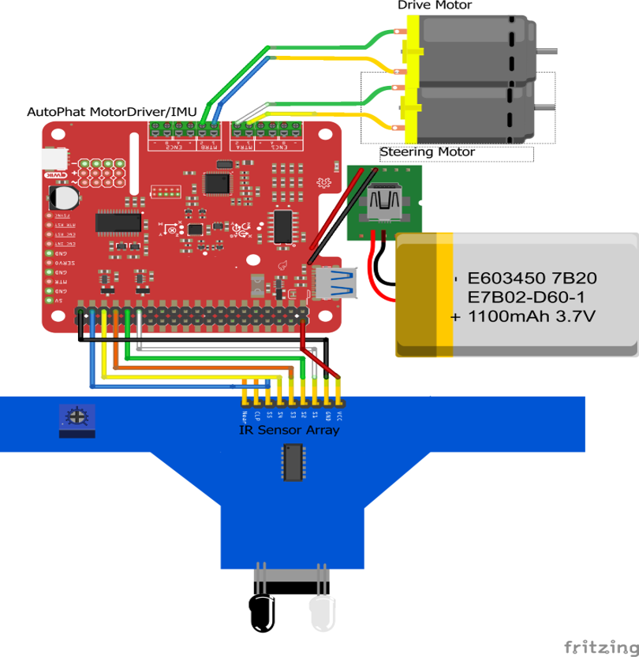

### Required Tools and Materials
For this project, you need, the car, a Raspberry Pi Zero W, a Sparkfun AutoPhat, GPIO connectors and wires, a 5 IR sensor array, hot glue gun, electrical tape, wire cutters, and a phillips screw driver.  Soldering iron is not required but can help secure connections we will make. 

### Prepare the Car
To prepare the car, we will take 4 screws off so we may take the top of the car off. Save these screws for we will need these later when we put the lid back on.

Once the lid is off, we will be gaining access to more of the green, blue, yellow, and gray wires that run from the two motors to the internal of the car. If you intend on restoring the intial use of the car, with the remote that comes in the box, you must keep the red wire that comes out of the chimney like hole intact. You can do this by taking the panel in the middle of the car off with its two screws, putting that wire through the side of the car, and screwing that piece back on. 

We need to cut the yellow, gray, green, and blue wires in a way that allows us to extend them and make them into GPIO connectors. I like to cut them fairly close to the middle of the car allowing most of the wire that runs to the two ends of the car to still be intact. 

### Setup Wires
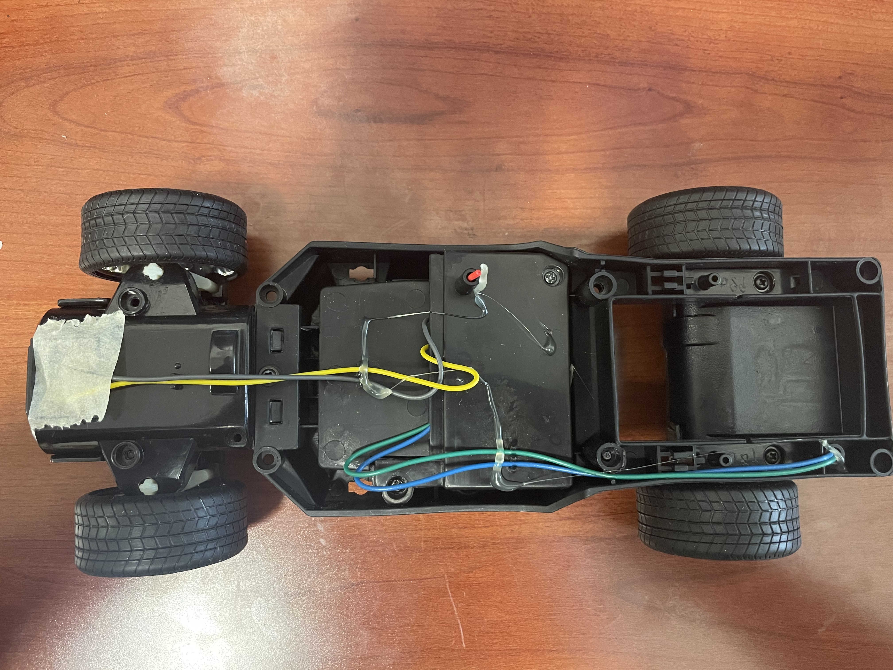

Once this is completed, we need to make these cables both long enough and able to be inserted into the AutoPhat's Pheonix connector. This can be done in a multitude of ways. You can solder these connectors, connect them via GPIO connectors, or simply twist the tips of wires and electrical tape them together. 

Of course, soldering is the best method of securing a connection but all 3 of them will suffice. These cables need to reach 3/4 down the car indicated in the image below. A fair amount of slack is recommended. 

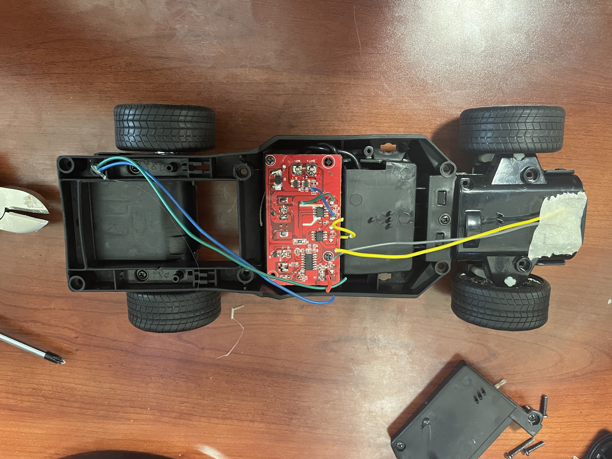

### Gluing Raspberry Pi Zero W
Now lets tackle the Raspberry Pi. Take your hot glue gun and glue the pi in the same spot I did in the image below. The camera connector, the white strip with a gray strip on one of the ends of the pi, on the edge of the inside body of the car. Position shown below.

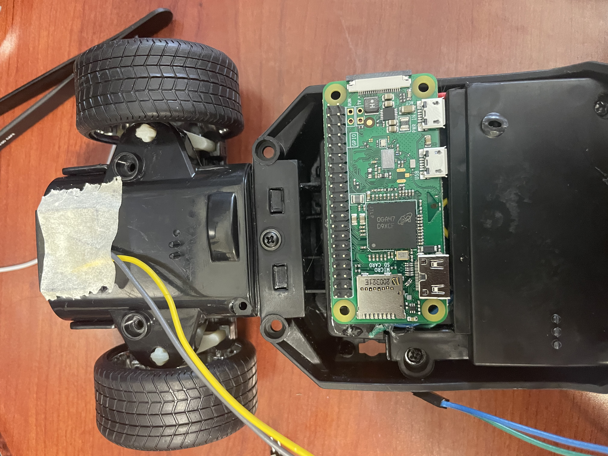

### Attaching IR Sensor Array
We next need to attach the IR sensor array to the bottom front of the car. The position is shown in the image below. It does not have to be exact but you do need to make sure that the wheels are not able to come in contact with this IR array when the wheels are turning. 

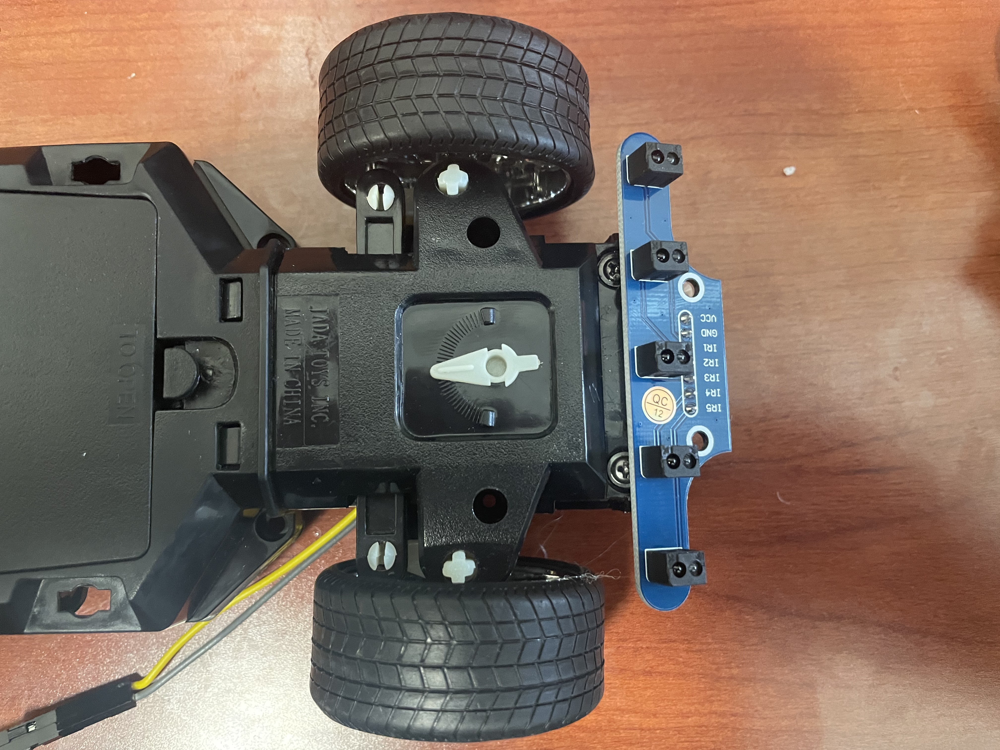

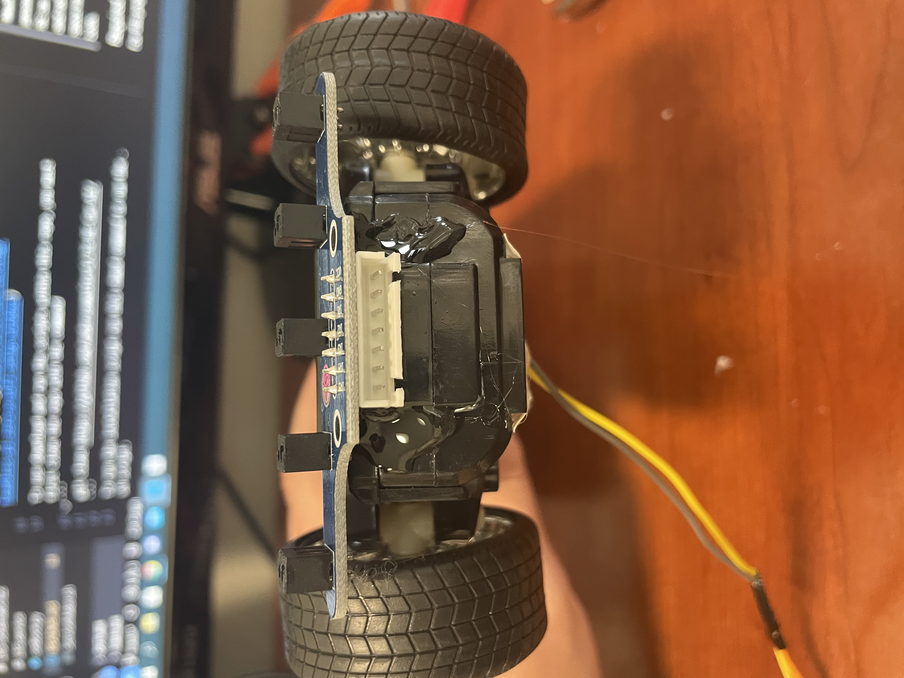

### AutoPhat Configuration
Next, we are going to put the AutoPhat on the top of the Raspberry Pi. The black bar on the bottom of it connects to the GPIO connectors on the Raspberry Pi. Face it so the green or black phenoix connectors are facing the back of the car. In the image below they are black. 

DO NOT hot glue the AutoPhat to anything. It will stay in place by the friction of the GPIO connectors on the Raspberry Pi. 

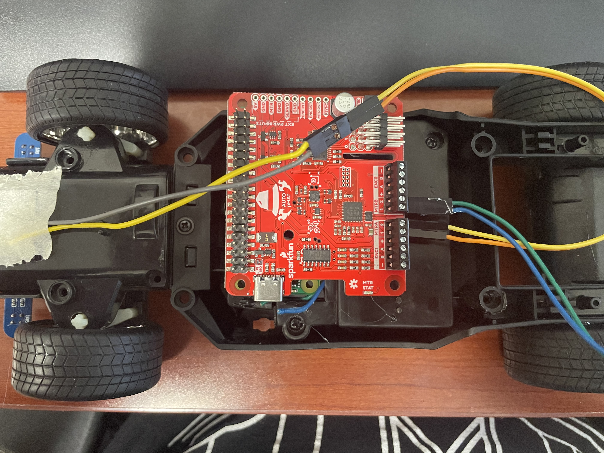

### Pheonix Connectors
Then connect the gray and yellow wires to MTRA1 and MTRA2 respectively. Then connect the blue and green wires to MTRB1 and MTRB2 respectively. To connect the wires to the Pheonix connectors, simply unscrew the top flathead screw until the wire is able to enter in the connector and then tighten it down.

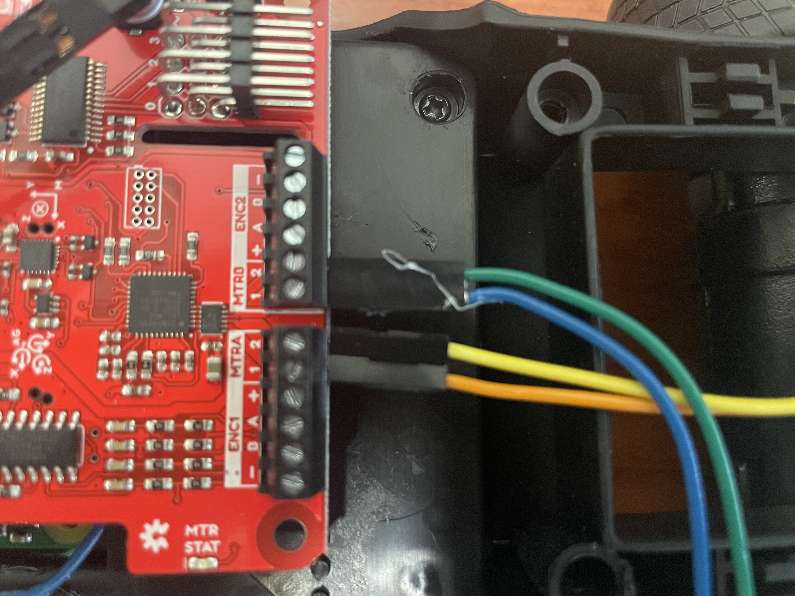

### Connecting GPIO Wires to Raspberry PI
Now connect the IR sensor connector to the IR sensor and run the wires from the front of the car to the Sparkfun Autophat and connect them to the GPIO pins in the electrical diagram above. 

ORDER MATTERS!!!

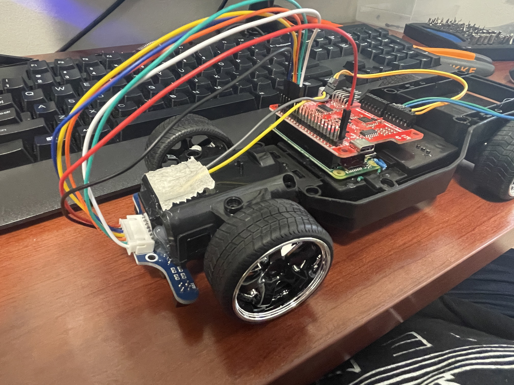

### Outer Body
That is all that needs to be done to the internal of the car. Now get the lid back infront of you along with your hot glue gun. Below are images on how to route the camera wire and the power cable 
which will run from the back of the car. The car is powered by a battery bank which is hot glued to the back of the car. You will run the power cable in between the panels of the outer lid of the car.

This is where you can be creative for aslong as these connectors can make it from camera to camera slot on the Pi, and from the battery bank to the AutoPhats USB C connector, you can connect it how you would like. 

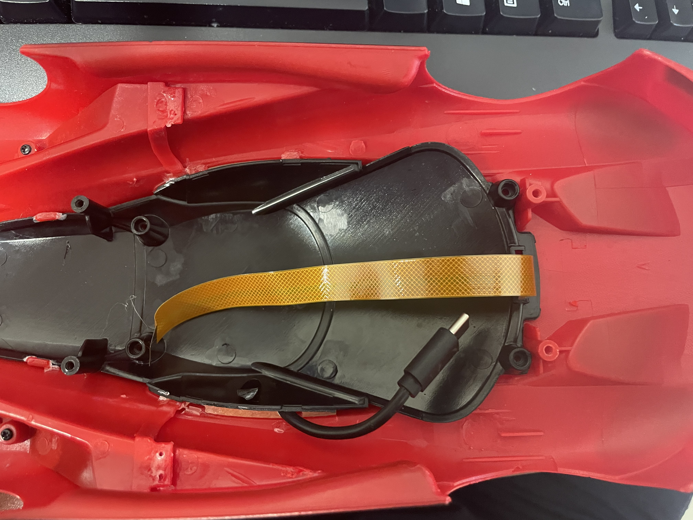

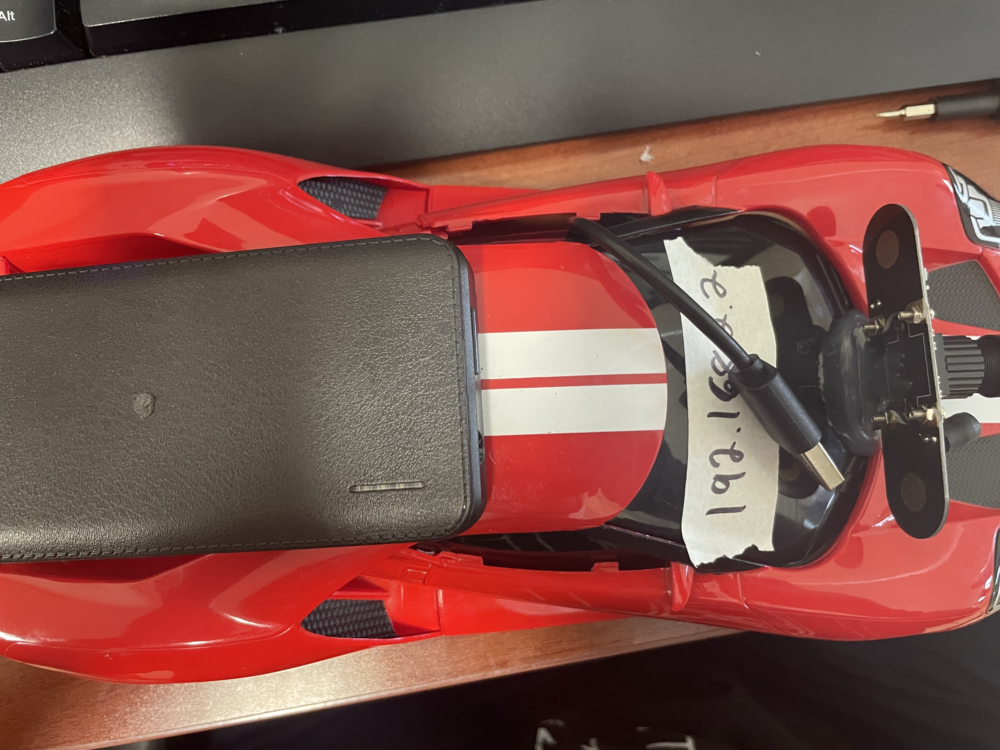

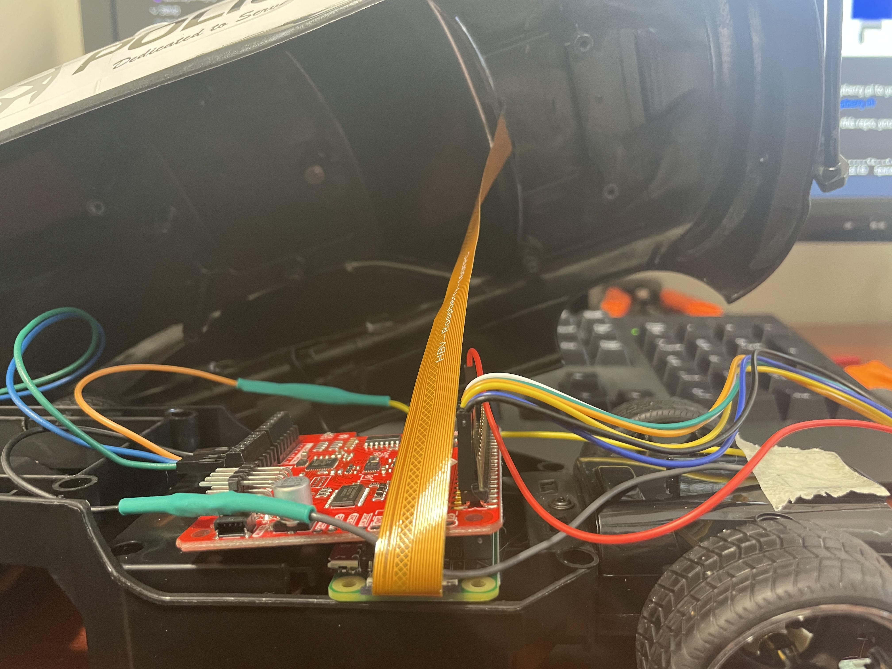

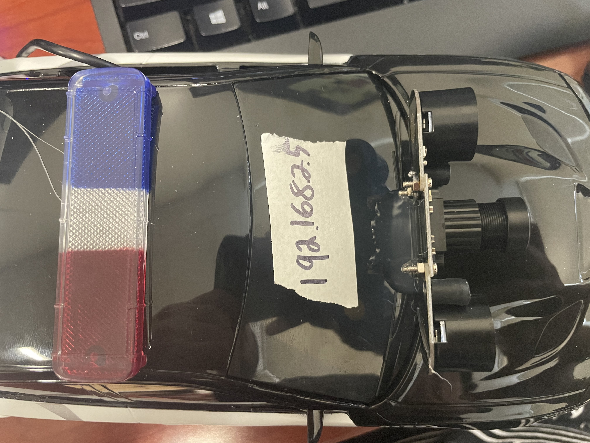

Once you connect those two wires to the internals, you just need the micro sd card with Raspbian to go into the Pi within the car. However, more setup is required to be able to connect to the Raspberry Pi. Below is a complete comprehensive guide to setting the software side of this project up. 

But for now, assuming you have properly setup the micro-sd card, you can insert it into the Pi, and connect the power cable to the battery bank. You will see green flashing lights if the Raspberry Pi is properly booting up. Once you confirmed this, you can put the 4 screws back connecting the lid to the internal car. 
