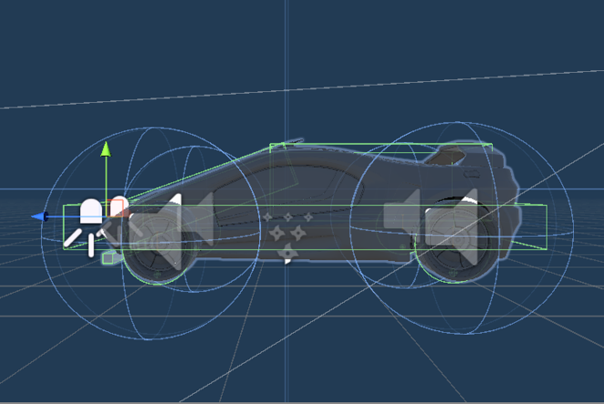
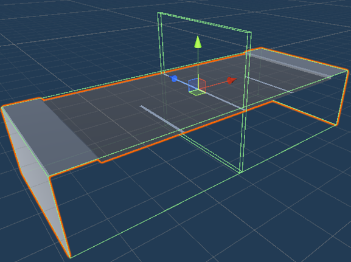
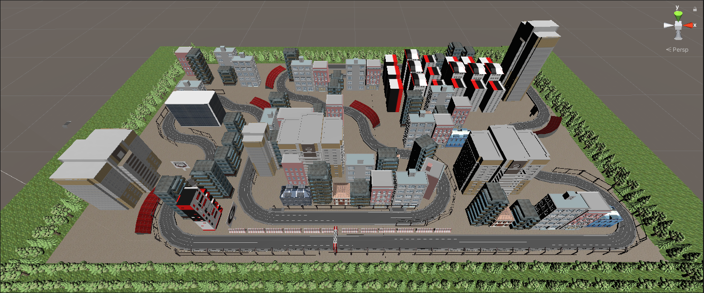
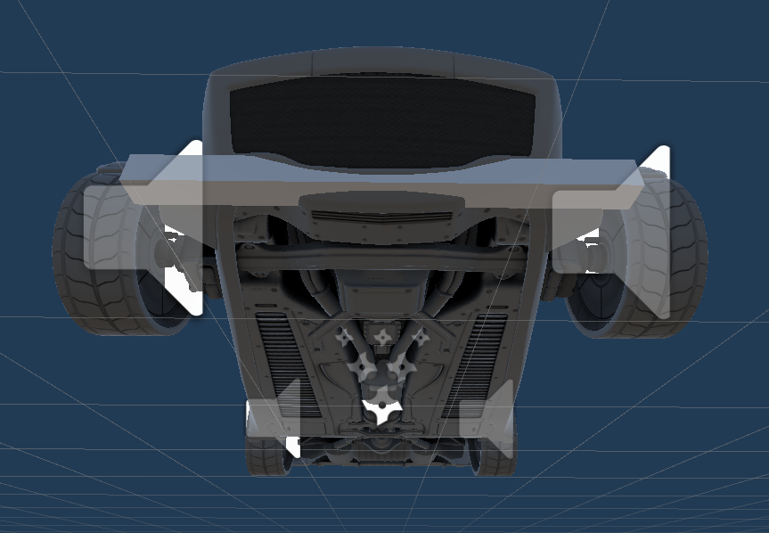
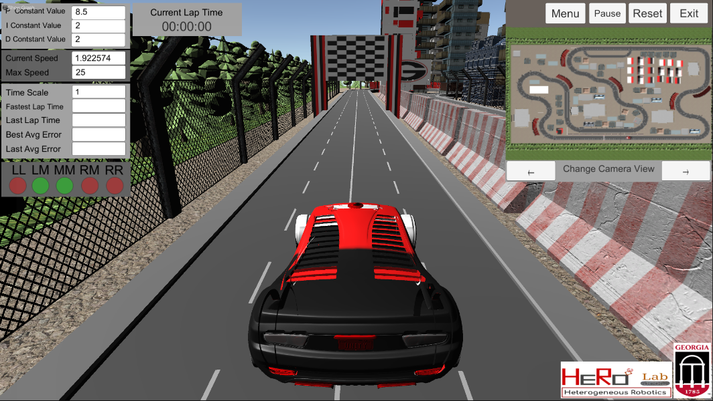

# HeRoCars
This repo consists of details and open-sourced codes and materials of the HeRoCars - a Robotics Learning Technology developed at the Heterogeneous Robotics Lab of the University of Georgia. HeRoCars is a simulator-hardware integrative framework consisting of a game-inspired Unity-based Simulator module and a low-cost hardware module of robotized RC cars. 

## HeRoCar Simulator

### Want to test it live ?
[Demo Live](https://andersonmolter1.github.io/LTG-Project-3D-RC-Car-Simulation/demo.html) - This is an earlier version of our simulator, so some of the features may not be visible/disabled. We are constantly developing this and will update this link periodically.

## PID (Proportional-Integral-Derivative) Controller

### Control Error? What's an Error?

One concept you will hear me talk about a lot in this tutorial is the idea of error. Error is going to refer to how far left or right the car is relative to the middle of the track.
In the simulation in this repo, the cars have 5 trackers on the front of the car that will be looking for where the car is on the track. We will talk about how they do this later in this tutorial. For now, keep in mind that if the car is not in the middle of the track or is swaying to one side of the track, the car will have a higher error. If the car is in the middle of the track, the car will have no error. 

#### P (Proportion)
  
This section of the model will be determining the initial amount of steering to be applied depedent on the amount of error off the line the car is experiencing. We will start with this variable at 25 to account for the 4 errors on each side of the line that can occur. 
#### I (Integral)
![\Large (J_I\sum_{n=0}^{k\vert_{k=v.len}}v\vert_{v=v[]})](https://latex.codecogs.com/gif.latex?%28J_I%5Csum_%7Bn%3D0%7D%5E%7Bk%5Cvert_%7Bk%3Dv.len%7D%7Dv%5Cvert_%7Bv%3Dv%5B%5D%7D%29)  
This section of the model will take into consideration all of the previous errors and add them up. If the summation of these errors is not 0, then this section will smooth out the correction to get back on the line. For now the constant will be set to 1. We will figure out the best value of this constant later.
#### D (Derivative)
  
This portion of the model calculates the delta between the previous error and the current error and then multiply that by the constant which we will figure out in a later step. For now, it will be set to 0. Once implemented, this should reduce the overshoot effect that can happen when the current error greatly deviates from the last error. 

#### PID Control
Control of this car is going to use a PID Controller Model below. The variable "error" will be defined by how far left or right the car is angled relative to the line the car is following. We will be calculating our error with the following logic. Error of Left (LL), Left-Middle (LM), Middle (M), Right-Middle (RM), Right (RR).

    0 0 0 0 1 ==> Error = 4
    0 0 0 1 1 ==> Error = 3
    0 0 0 1 0 ==> Error = 2
    0 0 1 1 0 ==> Error = 1
    0 0 1 0 0 ==> Error = 0
    0 1 1 0 0 ==> Error = -1
    0 1 0 0 0 ==> Error = -2
    1 1 0 0 0 ==> Error = -3
    1 0 0 0 0 ==> Error = -4

![\Large \alpha _{error} = (J_P\vert_{J_{P=25}}error) - (J_D\vert_{J_{D=0}}\frac{d}{dt}error) - (J_I\vert_{J_{I=0}}\sum_{n=0}^{k\vert_{k=v.len}}v\vert_{v=v[]})](https://latex.codecogs.com/gif.latex?%5CLarge%20%5Calpha%20_%7Berror%7D%20%3D%20%28J_P%5Cvert_%7BJ_%7BP%3D25%7D%7Derror%29%20-%20%28J_D%5Cvert_%7BJ_%7BD%3D0%7D%7D%5Cfrac%7Bd%7D%7Bdt%7Derror%29%20-%20%28J_I%5Cvert_%7BJ_%7BI%3D0%7D%7D%5Csum_%7Bn%3D0%7D%5E%7Bk%5Cvert_%7Bk%3Dv.len%7D%7Dv%5Cvert_%7Bv%3Dv%5B%5D%7D%29)

### Method of Detecting Error

#### Car Hitbox
The car being displayed below is part of the free asset "Standard Assets" from the Unity Store. The Unity team designed these to allow developers to easily drag and drop a realistic car with manual controls and realistic physics.   

#### Error Tracking
In order to tell where the car is, we need to give the car something to interact with. I have chosen to use an invisible rectangle that spands the length of the track. This rectangle has a Box Collider and will be the Trigger under the settings for its Box Collider. We are using it as a Trigger in order to allow the car to pass through it while still sending signals when another box collider runs into it.   

#### Asthetic Design
The track design we went with for Racetrack One is a European Forumla 1 style with sharp turns and varrying turn severity. We chose this design in order to test the capability of the AI to see if it is able to make quick and severe decisions.   

#### Trackers 
To actually know where the car is relative to the track, we are using box colliders which will tell the AI how severe of an error the car has. The car below has 5 trackers that line the front of the car. It may look like one line but that is because to get the best error we need to have overlapping trackers inorder to tell if the car is between two trackers. This is done for error accuracy as we will discuss below.   

A 1 in this visualization means that that sensor is currently interacting with the box collider that is in the middle of the track. As you can see from the Trackers section, 2 trackers can be interacting with that collider at the same time giving us a greater level of accurary when seeing where on the track the car currently is. 

##  Unity Simulator Interface

### Speed
You can adjust the top speed at which the car moves by changing the Max Speed value. The car will slow down automatically if it finds itself swerving off the track. This is to reset the cars position relative to the track.
### Timescale
Sometimes minor adjustments can make a huge difference but only really show themselves after multiple laps. You can see these changes by adjusting the Timescale value. This will speed up the game clock within the simulation and everything will run either faster or slower depending on how you change that value. The default is 1 and if you change it to 2 it will double the in-sim time; if you change it to .5, it will half the in-sim time.
### Minimap
There is a minimap in the top right that gives the user the ability to chnage to different camera views within the window given. There are three views: the overhead of the entire track, overhead of the car, and a hood view of the car. 
### Score
You can see the current game score based on your autonomous driving skills! (the parameters you choose for the PID)
### Sensor data
Here, you can see the live sensor data coming out of the IR sensor-array, the front-view camera image, and also the IMU data plots

### Tuning PID Controller

Remember! The correct PID tuning is based on many many factors so don't worry if it takes a while!

#### Tuning P
To start the tuning of the PID Controller, we will start with the P value. Make sure all other values are set to 0 but P constant. Then slowly increase this value until the car has a steady oscillation. 

#### Tuning D
We then will move on to tuning D or the variable D constant. We want to increase this value until those oscillations are dampened to your liking. 

#### Tuning I
We will then move to tuning I or the variable I constant. We want to increase this value until the oscillations are very minute and keep the car in a relatively straight position.

#### Helpful Tip!
If you cannot find the tuning that you desire, slow the speed of the car down and then try it again! Oscillation patterns are more common at higher speeds.

# Contributors

This work is contributed by the following students of [HeRoLab](http://hero.uga.edu) at the University of Georgia.

Anderson Molter, Undergraduate Research Assistant

## Heterogeneous Robotics (HeRoLab)

This project is a part of Swarms project at the Heterogeneous Robotics Research Lab (HeRoLab) of the University of Georgia.

Please contact hero at uga . edu for any queries

http://hero.uga.edu/

